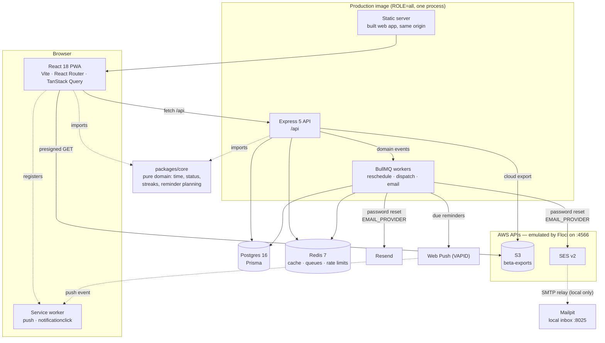

# Beta

A reminder-first habit tracker. Most trackers wait to be opened; Beta tells you
when a habit is due, from a plan it keeps up to date on the server, and delivers
it as a Web Push notification whether or not the app is running.

TypeScript end to end: React 18 + Vite PWA, Express 5 + Prisma + Postgres,
Redis and BullMQ for caching and jobs, and a pure domain core shared by both
sides so a streak means the same thing in the browser and on the server.

---

## Architecture



One image, one origin. The API serves `/api`; everything else is the built web
app. Same origin means no CORS anywhere and first-party cookies, which is what
lets the refresh cookie stay `SameSite=Strict`. The one exception is a cloud
export: the browser downloads it straight from S3 through a short-lived
presigned URL, so the file never streams back through the API.

**API reference:** Swagger UI at `/api/docs` when `DOCS_ENABLED=true`, generated
from the same zod schemas that validate requests. Route-by-route notes live in
[`SPEC.md` §9](SPEC.md).

---

## Run it locally

Docker Desktop and Node 22 are the only prerequisites. From a clean checkout:

```bash
cp .env.example .env     # 1. fill in JWT_SECRET; VAPID keys if you want push
pnpm install             # 2.
pnpm dev                 # 3. builds the images, migrates, starts everything
```

Open **http://localhost:5173**. The API is on `http://localhost:4000`, Postgres
on `5433` and Redis on `6380` (offset so they never collide with local
installs), Floci's AWS endpoint on `4566` and the Mailpit inbox on
**http://localhost:8025**. `pnpm dev` runs Postgres, Redis, Floci, Mailpit, a
one-shot core build, a one-shot migration, a one-shot AWS setup, the API, the
worker and the Vite dev server; the web container proxies `/api` to the API
container, so the browser only ever sees one origin.

Two more, when you need them:

```bash
pnpm check               # core build → typecheck → lint → prettier → all tests
docker build -t beta:prod . && docker run --rm -p 3000:3000 --env-file .env beta:prod
```

The API suite needs the Compose Postgres and Redis running, and uses a separate
`beta_test` database — `DATABASE_URL_TEST` must differ from `DATABASE_URL`, and
a guard refuses to run if it doesn't.

Each container's `node_modules` is a named volume, filled from the image only
when the volume is first created. After a pull that adds a dependency (a
`Cannot find module` on startup), rebuild and recreate them — the database is
untouched:

```bash
docker compose down && docker volume rm beta_beta_node_modules beta_beta_core_node_modules beta_beta_api_node_modules beta_beta_web_node_modules
docker compose build && pnpm dev
```

Push notifications need VAPID keys (`npx web-push generate-vapid-keys`); without
them the app runs and push reports itself as off. Password-reset email and cloud
export work out of the box under Compose, against Floci (below).

---

## Local AWS with Floci

Password-reset email goes through the Amazon SES API and cloud export through
the S3 API, and both are developed and tested against those APIs emulated
locally by [Floci](https://floci.io) on one endpoint, `http://localhost:4566`.
The code uses the official AWS SDK v3 clients; it is free, works offline and
needs no AWS account. **Beta is not deployed on AWS and there is no AWS
account.** Targeting real AWS is a documented plan
([below](#moving-to-real-aws-the-plan)): the same code with different
environment variables — no branch says "if local".

Compose wires it up: `floci` is the emulator, `aws-init` is a one-shot AWS CLI
container that runs `scripts/floci-init.sh` (idempotent) to create the
`beta-exports` bucket, block public access, expire `exports/` after a day and
verify the `EMAIL_FROM` sender in SES, and `api`/`worker` wait for it to finish.
Floci relays every email SES sends to `mailpit` over SMTP, so a reset email
lands in a real inbox UI. Floci's state is disposable: restarting it starts
from empty, and `aws-init` recreates the bucket.

| Variable                                      | Default                             | Purpose                                                                                    |
| --------------------------------------------- | ----------------------------------- | ------------------------------------------------------------------------------------------ |
| `EMAIL_PROVIDER`                              | `none` (`ses` under Compose)        | `resend` \| `ses` \| `none`. Unset with `RESEND_API_KEY` set means `resend`, as before.    |
| `EMAIL_FROM`                                  | unset (`Beta <no-reply@beta.test>`) | Sender; required by `resend` and `ses`, and startup fails with a clear message without it. |
| `AWS_REGION`                                  | `us-east-1`                         |                                                                                            |
| `AWS_ACCESS_KEY_ID` / `AWS_SECRET_ACCESS_KEY` | unset (`test`/`test` locally)       | Unset would mean the SDK's default credential chain (an IAM role). Never logged.           |
| `AWS_ENDPOINT_URL`                            | unset (`http://floci:4566`)         | Where the API and worker reach AWS. Unset would mean real AWS.                             |
| `AWS_PUBLIC_ENDPOINT_URL`                     | unset (`http://localhost:4566`)     | Only for signing URLs the browser opens — the browser cannot resolve `floci`.              |
| `S3_EXPORT_BUCKET`                            | unset (`beta-exports`)              | Unset turns cloud export off; `POST /api/export/cloud` then answers 404.                   |
| `EXPORT_URL_TTL_SECONDS`                      | `900`                               | Lifetime of the presigned download URL.                                                    |

Values in parentheses are what Compose sets. If you used Resend through `.env`
before, add `EMAIL_PROVIDER=resend` there: Compose now defaults to `ses`.

**Why two endpoints.** The API container reaches Floci as `http://floci:4566`;
the browser can only reach `http://localhost:4566`. A SigV4 presigned URL signs
the host, so rewriting `floci` to `localhost` afterwards would break the
signature. `S3ObjectStore` uploads with one client and presigns with a second
one configured with `AWS_PUBLIC_ENDPOINT_URL`. Presigning is local crypto, not a
network call. On real AWS both would be unset and both clients would use the
regional endpoint.

### Demo

After `pnpm dev`, give it something to show: request a reset on the "Forgot
password" screen, then sign in and press **Save export to cloud** in Settings →
Data. Then, from a host shell (the host has no AWS profile, so export Floci's
dummy credentials first):

```bash
export AWS_ACCESS_KEY_ID=test AWS_SECRET_ACCESS_KEY=test AWS_DEFAULT_REGION=us-east-1

aws --endpoint-url http://localhost:4566 s3 ls s3://beta-exports --recursive   # the uploaded export
aws --endpoint-url http://localhost:4566 ses list-identities                   # the verified sender
curl -s http://localhost:4566/_aws/ses | jq                                     # every email SES sent
open http://localhost:8025                                                      # Mailpit inbox
```

`open` is macOS; use `start` on Windows and `xdg-open` on Linux.
`curl -X DELETE http://localhost:4566/_aws/ses` clears the captured emails.

The same emulator runs in CI: `test/floci.integration.test.ts` uploads through
`S3ObjectStore`, fetches the presigned URL and checks the JSON round-trips, and
sends through `SesMailer` and finds the message at `/_aws/ses`. It only runs
with `FLOCI_TESTS=1`; locally, `FLOCI_TESTS=1 pnpm --filter @beta/api test`
with `pnpm dev` up.

### Moving to real AWS: the plan

Not done — Beta runs only against Floci. This is what would change, with no
code changes, if it moved to an AWS account:

| Variable                                      | Local (Compose)             | Real AWS                                                   |
| --------------------------------------------- | --------------------------- | ---------------------------------------------------------- |
| `AWS_ENDPOINT_URL`                            | `http://floci:4566`         | unset                                                      |
| `AWS_PUBLIC_ENDPOINT_URL`                     | `http://localhost:4566`     | unset                                                      |
| `AWS_ACCESS_KEY_ID` / `AWS_SECRET_ACCESS_KEY` | `test` / `test`             | unset — the default credential chain picks up the IAM role |
| `AWS_REGION`                                  | `us-east-1`                 | your region                                                |
| `S3_EXPORT_BUCKET`                            | `beta-exports`              | your bucket                                                |
| `EMAIL_PROVIDER`                              | `ses`                       | `ses`                                                      |
| `EMAIL_FROM`                                  | `Beta <no-reply@beta.test>` | an identity verified in SES                                |

The IAM role would need no more than this:

```json
{
  "Version": "2012-10-17",
  "Statement": [
    {
      "Effect": "Allow",
      "Action": ["s3:PutObject", "s3:GetObject"],
      "Resource": "arn:aws:s3:::<bucket>/exports/*"
    },
    {
      "Effect": "Allow",
      "Action": "ses:SendEmail",
      "Resource": "*"
    }
  ]
}
```

`s3:GetObject` is there because a presigned URL carries the signer's
permissions. Two things the init script does locally would be a one-off job for
IaC or the console in a real account: the bucket's public access block and its
one-day lifecycle rule on `exports/`. And real SES starts in sandbox mode, where
it only delivers to verified recipients until production access is granted.

---

## Design decisions

### One time engine, in the domain core

Every date question — what day is it for this user, is this habit due, is this
week's target met, when should the next reminder fire — is answered by
`packages/core/src/time.ts` and the modules above it. Nothing else calls
`new Date()` arithmetic, and an ESLint rule fails the build if it tries. Days
are `YYYY-MM-DD` keys in the user's IANA zone, computed with `Intl`, so a user
in Dubai and a server in UTC agree on when "today" ends, DST included.

The core is pure: no I/O, no Prisma, no clock of its own — the current time is
always a parameter. That is what lets the same `statusOn` and `buildStats` run
in the browser for an optimistic update and on the server for the real answer,
and it is why the core's tests can assert on time zones without a database.

### Auth: short access token in memory, rotating refresh cookie

A 15-minute HS256 access token lives in a JavaScript variable — never
`localStorage`, so an XSS bug cannot read it back later. The refresh token is an
opaque, hashed-at-rest value in an `HttpOnly`, `SameSite=Strict`, `Secure`
cookie, rotated on every use. Presenting an already-rotated token is treated as
theft: the whole token family is revoked, which signs out the attacker and the
victim together rather than letting a stolen token live quietly. Concurrent 401s
share a single in-flight refresh, so a screen that fires five queries at once
refreshes once.

### Reminders: planned on write, dispatched on a tick

Changing a habit, logging one, snoozing, or moving your week start emits a
domain event. Each one enqueues a `reschedule-user` job keyed by user id and
delayed two seconds, so a burst of taps collapses into one replan. That job
writes `ReminderOccurrence` rows — the exact instants this user's reminders
should fire.

A separate repeatable job ticks every minute and claims what is due with
`UPDATE … WHERE id IN (SELECT … FOR UPDATE SKIP LOCKED)`, which makes delivery
at-most-once even with several workers running. Before sending it re-checks the
world: a habit that was completed, archived, deleted or snoozed since the plan
was written is cancelled rather than sent, and so is one for a user whose last
push subscription has gone. Subscriptions that the push service reports as gone
(404/410) are deleted on the spot.

### Caching: Redis, invalidated by generation

`/api/stats` is the only expensive read, so it is cached per user, per day, per
range with a one-hour TTL and an `X-Cache` header. Naive invalidation loses two
races — a read that started before a write finished, and a delete that lands
between a computation and its store. Both are closed with a per-user generation
counter: a cached value carries the generation it was computed under, an
invalidation does `INCR` synchronously, and anything tagged with an older
generation is ignored. Keys are tracked in a set and deleted through it; `KEYS`
is never used.

### Dependency injection everywhere

`createApp(deps)` takes Prisma, Redis, the queues, the clock, the event bus, the
mailer, the push sender and the object store. Production wires the real ones in
`server.ts`; tests pass `FixedClock`, `FakeMailer`, `FakePushSender`,
`FakeQueues` and `FakeObjectStore` against a _real_ Postgres and a _real_
Redis, so the SQL and the rate limiter are genuinely exercised while nothing
leaves the process.

---

## Known limitations

- **Free-tier sleeping.** On a host that sleeps idle instances, the dispatch
  tick stops with the process, and reminders are late by however long the
  instance was asleep. A pinger or a paid always-on instance is the fix.
- **iOS needs Home Screen install.** Safari only delivers Web Push to a PWA
  added to the Home Screen; in a browser tab, notifications never arrive. The
  Settings screen says so.
- **Delivery is best-effort.** A notification the OS drops is not retried and
  there is no in-app inbox of missed reminders.
- **The year grid reads transposed.** Columns are weeks and rows are weekdays,
  so a screen reader walks down a week rather than across a month, and the grid
  has no row or column headers. Keyboard navigation (roving tabindex, arrows,
  Home/End) works; the reading order is a known compromise of the layout.
- **Single region, single instance.** No read replicas, no horizontal scaling
  story beyond "the claim query is safe if you run more than one worker".
- **No offline writes.** The service worker handles push only. Without a
  network the app shows cached data and mutations fail.

---

## Skills map

| Job requirement                                              | Where it's demonstrated                                                                              |
| ------------------------------------------------------------ | ---------------------------------------------------------------------------------------------------- |
| Full-stack features, React 18 + Node/TypeScript Express      | `apps/web`, `apps/api`, shared `packages/core`                                                       |
| RESTful API design, consumed with React Query                | Routes in `apps/api/src/modules`, OpenAPI at `/api/docs`, optimistic mutations in `apps/web/src/api` |
| Postgres + Prisma, efficient queries and data models         | `apps/api/prisma/schema.prisma`: composite keys, indexes, range queries, `SKIP LOCKED` claim         |
| Redis caching                                                | `apps/api/src/modules/stats/cache.ts` — generation-tagged invalidation, `X-Cache` header             |
| Mocha/ts-mocha API tests, Vitest + Testing Library web tests | `apps/api/test`, `apps/web/src/**/*.test.tsx`, `packages/core/test`                                  |
| Code reviews, agile workflow                                 | Milestone branches, Conventional Commits, PR records in [`docs/milestones`](docs/milestones)         |
| Dependency injection                                         | `createApp(deps)` in `apps/api/src/app.ts`, with swappable fakes                                     |
| Event-driven patterns, job queues                            | Domain events → BullMQ reschedule, dispatch and email workers (`apps/api/src/jobs`)                  |
| Secure coding (validation, authN/authZ, OWASP)               | zod at every boundary, refresh-token reuse detection, IDOR tests, rate limits, log redaction         |
| CI/CD, reading build reports                                 | `.github/workflows/ci.yml` — service containers, JUnit and coverage artifacts, image build           |
| Docker and cloud service dependencies                        | `Dockerfile.dev` + Compose for development, multi-stage `Dockerfile` for production                  |
| AWS APIs (S3, SES) and SMTP, emulated locally                | `S3ObjectStore` (presigned URLs), `SesMailer`, Floci + Mailpit in Compose, integration tests in CI   |

---

## Repository

```
apps/api      Express 5, Prisma, BullMQ workers, ts-mocha tests
apps/web      React 18 PWA, Vite, Tailwind v4, Radix, Vitest tests
packages/core Pure domain: time, status, streaks, stats, reminder planning
docs/milestones  What each milestone shipped, how it was broken on purpose, and what that found
SPEC.md       The build specification this was written against
```

Each milestone was verified by breaking it: removing a rollback handler, a
guard, a shared promise, and confirming the test that claims to cover it
actually fails. [`docs/milestones/README.md`](docs/milestones/README.md) lists
the seven bugs a green test suite missed and what caught them instead.
