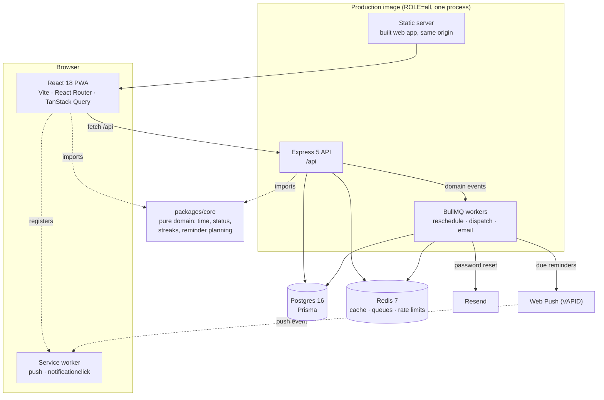

# Beta

A reminder-first habit tracker. Most trackers wait to be opened; Beta tells you
when a habit is due, from a plan it keeps up to date on the server, and delivers
it as a Web Push notification whether or not the app is running.

TypeScript end to end: React 18 + Vite PWA, Express 5 + Prisma + Postgres,
Redis and BullMQ for caching and jobs, and a pure domain core shared by both
sides so a streak means the same thing in the browser and on the server.

---

## Architecture



One image, one origin. The API serves `/api`; everything else is the built web
app. Same origin means no CORS anywhere and first-party cookies, which is what
lets the refresh cookie stay `SameSite=Strict`.

**API reference:** Swagger UI at `/api/docs` when `DOCS_ENABLED=true`, generated
from the same zod schemas that validate requests. Route-by-route notes live in
[`SPEC.md` §9](SPEC.md).

---

## Run it locally

Docker Desktop and Node 22 are the only prerequisites. From a clean checkout:

```bash
cp .env.example .env     # 1. fill in JWT_SECRET; VAPID keys if you want push
pnpm install             # 2.
pnpm dev                 # 3. builds the images, migrates, starts everything
```

Open **http://localhost:5173**. The API is on `http://localhost:4000`, Postgres
on `5433` and Redis on `6380` (offset so they never collide with local
installs). `pnpm dev` runs Postgres, Redis, a one-shot core build, a one-shot
migration, the API, the worker and the Vite dev server; the web container
proxies `/api` to the API container, so the browser only ever sees one origin.

Two more, when you need them:

```bash
pnpm check               # core build → typecheck → lint → prettier → all tests
docker build -t beta:prod . && docker run --rm -p 3000:3000 --env-file .env beta:prod
```

The API suite needs the Compose Postgres and Redis running, and uses a separate
`beta_test` database — `DATABASE_URL_TEST` must differ from `DATABASE_URL`, and
a guard refuses to run if it doesn't.

Push notifications need VAPID keys (`npx web-push generate-vapid-keys`) and
password reset needs a Resend key; without them the app runs, and those two
features report themselves as off.

---

## Design decisions

### One time engine, in the domain core

Every date question — what day is it for this user, is this habit due, is this
week's target met, when should the next reminder fire — is answered by
`packages/core/src/time.ts` and the modules above it. Nothing else calls
`new Date()` arithmetic, and an ESLint rule fails the build if it tries. Days
are `YYYY-MM-DD` keys in the user's IANA zone, computed with `Intl`, so a user
in Dubai and a server in UTC agree on when "today" ends, DST included.

The core is pure: no I/O, no Prisma, no clock of its own — the current time is
always a parameter. That is what lets the same `statusOn` and `buildStats` run
in the browser for an optimistic update and on the server for the real answer,
and it is why the core's tests can assert on time zones without a database.

### Auth: short access token in memory, rotating refresh cookie

A 15-minute HS256 access token lives in a JavaScript variable — never
`localStorage`, so an XSS bug cannot read it back later. The refresh token is an
opaque, hashed-at-rest value in an `HttpOnly`, `SameSite=Strict`, `Secure`
cookie, rotated on every use. Presenting an already-rotated token is treated as
theft: the whole token family is revoked, which signs out the attacker and the
victim together rather than letting a stolen token live quietly. Concurrent 401s
share a single in-flight refresh, so a screen that fires five queries at once
refreshes once.

### Reminders: planned on write, dispatched on a tick

Changing a habit, logging one, snoozing, or moving your week start emits a
domain event. Each one enqueues a `reschedule-user` job keyed by user id and
delayed two seconds, so a burst of taps collapses into one replan. That job
writes `ReminderOccurrence` rows — the exact instants this user's reminders
should fire.

A separate repeatable job ticks every minute and claims what is due with
`UPDATE … WHERE id IN (SELECT … FOR UPDATE SKIP LOCKED)`, which makes delivery
at-most-once even with several workers running. Before sending it re-checks the
world: a habit that was completed, archived, deleted or snoozed since the plan
was written is cancelled rather than sent, and so is one for a user whose last
push subscription has gone. Subscriptions that the push service reports as gone
(404/410) are deleted on the spot.

### Caching: Redis, invalidated by generation

`/api/stats` is the only expensive read, so it is cached per user, per day, per
range with a one-hour TTL and an `X-Cache` header. Naive invalidation loses two
races — a read that started before a write finished, and a delete that lands
between a computation and its store. Both are closed with a per-user generation
counter: a cached value carries the generation it was computed under, an
invalidation does `INCR` synchronously, and anything tagged with an older
generation is ignored. Keys are tracked in a set and deleted through it; `KEYS`
is never used.

### Dependency injection everywhere

`createApp(deps)` takes Prisma, Redis, the queues, the clock, the event bus, the
mailer and the push sender. Production wires the real ones in `server.ts`; tests
pass `FixedClock`, `FakeMailer`, `FakePushSender` and `FakeQueues` against a
_real_ Postgres and a _real_ Redis, so the SQL and the rate limiter are
genuinely exercised while nothing leaves the process.

---

## Known limitations

- **Free-tier sleeping.** On a host that sleeps idle instances, the dispatch
  tick stops with the process, and reminders are late by however long the
  instance was asleep. A pinger or a paid always-on instance is the fix.
- **iOS needs Home Screen install.** Safari only delivers Web Push to a PWA
  added to the Home Screen; in a browser tab, notifications never arrive. The
  Settings screen says so.
- **Delivery is best-effort.** A notification the OS drops is not retried and
  there is no in-app inbox of missed reminders.
- **The year grid reads transposed.** Columns are weeks and rows are weekdays,
  so a screen reader walks down a week rather than across a month, and the grid
  has no row or column headers. Keyboard navigation (roving tabindex, arrows,
  Home/End) works; the reading order is a known compromise of the layout.
- **Single region, single instance.** No read replicas, no horizontal scaling
  story beyond "the claim query is safe if you run more than one worker".
- **No offline writes.** The service worker handles push only. Without a
  network the app shows cached data and mutations fail.

---

## Skills map

| Job requirement                                              | Where it's demonstrated                                                                              |
| ------------------------------------------------------------ | ---------------------------------------------------------------------------------------------------- |
| Full-stack features, React 18 + Node/TypeScript Express      | `apps/web`, `apps/api`, shared `packages/core`                                                       |
| RESTful API design, consumed with React Query                | Routes in `apps/api/src/modules`, OpenAPI at `/api/docs`, optimistic mutations in `apps/web/src/api` |
| Postgres + Prisma, efficient queries and data models         | `apps/api/prisma/schema.prisma`: composite keys, indexes, range queries, `SKIP LOCKED` claim         |
| Redis caching                                                | `apps/api/src/modules/stats/cache.ts` — generation-tagged invalidation, `X-Cache` header             |
| Mocha/ts-mocha API tests, Vitest + Testing Library web tests | `apps/api/test`, `apps/web/src/**/*.test.tsx`, `packages/core/test`                                  |
| Code reviews, agile workflow                                 | Milestone branches, Conventional Commits, PR records in [`docs/milestones`](docs/milestones)         |
| Dependency injection                                         | `createApp(deps)` in `apps/api/src/app.ts`, with swappable fakes                                     |
| Event-driven patterns, job queues                            | Domain events → BullMQ reschedule, dispatch and email workers (`apps/api/src/jobs`)                  |
| Secure coding (validation, authN/authZ, OWASP)               | zod at every boundary, refresh-token reuse detection, IDOR tests, rate limits, log redaction         |
| CI/CD, reading build reports                                 | `.github/workflows/ci.yml` — service containers, JUnit and coverage artifacts, image build           |
| Docker and cloud service dependencies                        | `Dockerfile.dev` + Compose for development, multi-stage `Dockerfile` for production                  |

---

## Repository

```
apps/api      Express 5, Prisma, BullMQ workers, ts-mocha tests
apps/web      React 18 PWA, Vite, Tailwind v4, Radix, Vitest tests
packages/core Pure domain: time, status, streaks, stats, reminder planning
docs/milestones  What each milestone shipped, how it was broken on purpose, and what that found
SPEC.md       The build specification this was written against
```

Each milestone was verified by breaking it: removing a rollback handler, a
guard, a shared promise, and confirming the test that claims to cover it
actually fails. [`docs/milestones/README.md`](docs/milestones/README.md) lists
the seven bugs a green test suite missed and what caught them instead.
